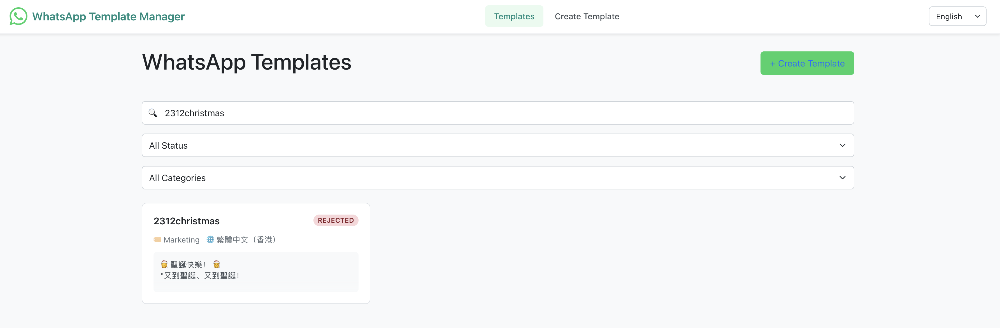
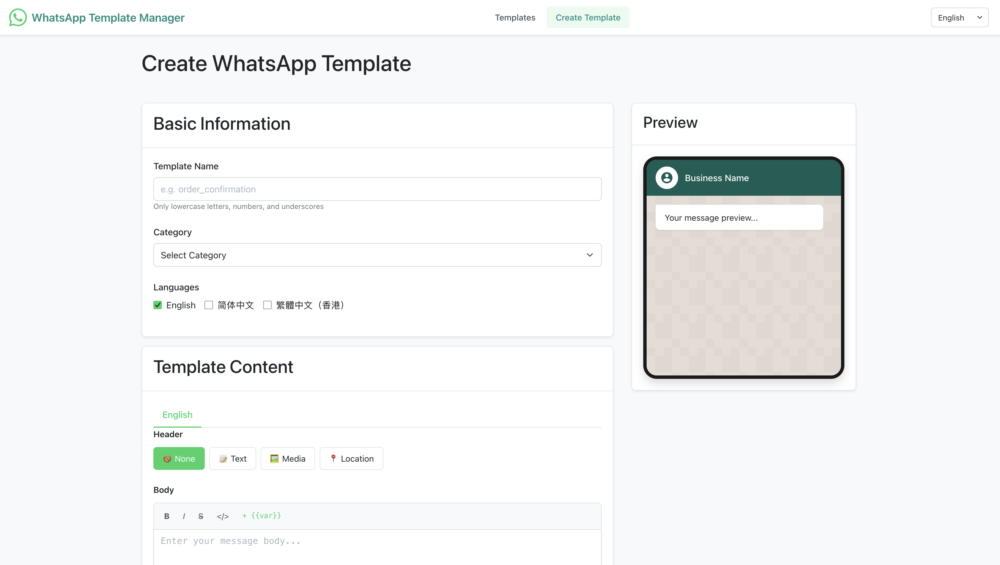
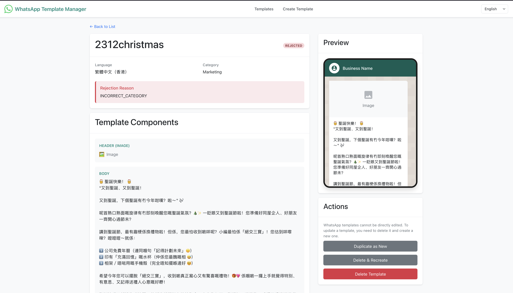

# WhatsApp-YCloud-Demo
Implement WhatsApp Functions via YCloud API.

## Program Details
- Frontend pages live under `template/` (list, view, creation) and use vanilla HTML/CSS/JS.
- Backend proxy at `template/api/proxy.php` sends requests to YCloud and logs to `template/logs/`.
- Deleting templates uses the YCloud path format: `/whatsapp/templates/{wabaId}/{name}/{language}`.

## Preview

## API Doc
https://docs.ycloud.com/reference/introduction